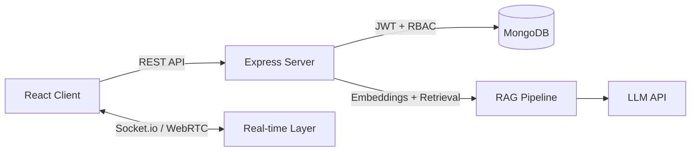

**I build production-style full-stack apps with secure APIs, real-time features and LLM-powered functionality.**

📍 Kozhikode, Kerala, India &nbsp;·&nbsp; 🟢 **Open to MERN / Full-Stack Developer roles**

---

## 📊 At a Glance

| 80+ | 15+ | 200+ | 2 |
|:---:|:---:|:---:|:---:|
| REST endpoints in one app (FitForge) | Backend modules in one app (FitForge) | Product listings in Audibox | Payment gateways integrated (Stripe, Razorpay) |

---

## 💼 Experience

### MERN Stack Developer · Bridgeon Solutions
📍 Kozhikode, Kerala &nbsp;|&nbsp; 🗓️ START-DATE – Present

- Build full-stack web applications with React, Node.js, Express and MongoDB
- Integrate LLM-powered features into production systems
- Write clean, secure and scalable code
<!-- Add 2-3 more bullets with real work: features you shipped, bugs you fixed, tools you used -->

---

## 🚀 Featured Projects

### 🏋️ FitForge — AI-Powered Fitness Platform
Connects clients with trainers, with AI built into the core experience.

[**Live Demo**](https://fitforge-hd.vercel.app/) &nbsp;·&nbsp; [**Source Code**](https://github.com/hilalahmd/Single-Project-)

- **80+ REST endpoints** across **15+ modules**
- **Custom RAG chatbot** for fitness Q&A
- **AI-generated 30-day** diet and workout plans
- **Live video coaching** with WebRTC
- Real-time communication with Socket.io

`React` `Node.js` `Express` `MongoDB` `Socket.io` `WebRTC` `RAG`

### 🛒 Audibox — Full-Stack E-Commerce Platform
Complete shopping flow with payments and an admin side.

[**Live Demo**](https://audibox-e-commerce-erlk.vercel.app/) &nbsp;·&nbsp; [**Source Code**](https://github.com/hilalahmd/Audibox-E-commerce)

- **200+ product listings**
- **Stripe and Razorpay** payment integration
- **Admin analytics dashboard**
- Security hardening with **Helmet and role-based access control**

`React` `Vite` `Node.js` `Express` `MongoDB` `Stripe` `Razorpay`

### 🔁 HabitFlow — AI Habit Tracker
Deployed habit tracker with AI features and web push notifications.

[**Live Demo**](ADD-LINK) &nbsp;·&nbsp; [**Source Code**](ADD-LINK)

- AI-powered habit insights using an LLM API
- Web push notifications

`React` `Node.js` `MongoDB`

---

## 🏗️ How FitForge Works

---

## 🛠️ Skills

| Area | Technologies |
|---|---|
| **Frontend** |      |
| **Backend** |     |
| **Database** |  Mongoose, Aggregation Pipeline, Data Modeling |
| **AI** | RAG pipelines, Vector Embeddings, Semantic Search, LLM API Integration |
| **Security** | JWT, HttpOnly Cookies, bcrypt, RBAC, Rate Limiting, Helmet |
| **Deployment** |    MongoDB Atlas, Cloudinary |
| **Tools** |    |

---

## 🔐 Engineering Practices

- **Architecture:** MVC structure, modular REST APIs, clean separation of concerns
- **Security:** JWT with HttpOnly cookies, bcrypt hashing, RBAC, rate limiting, Helmet headers
- **Data:** Mongoose schemas, aggregation pipelines for analytics
- **Delivery:** Git workflow, Postman-tested APIs, deployed on Vercel, Render and AWS

---

<!-- Optional: uncomment once your account has some activity
## 📈 GitHub Activity

-->

## 📫 Let's Work Together

I'm looking for a **MERN Stack / Full-Stack Developer** role where I can ship real products and keep growing.

- 📧 **Email:** [hilaljr970@gmail.com](mailto:hilaljr970@gmail.com)
- 🌐 **Portfolio:** [portfolio-one-gold-29.vercel.app](https://portfolio-one-gold-29.vercel.app)
- 💼 **LinkedIn:** [Connect with me](https://www.linkedin.com/in/YOUR-LINKEDIN-USERNAME)

